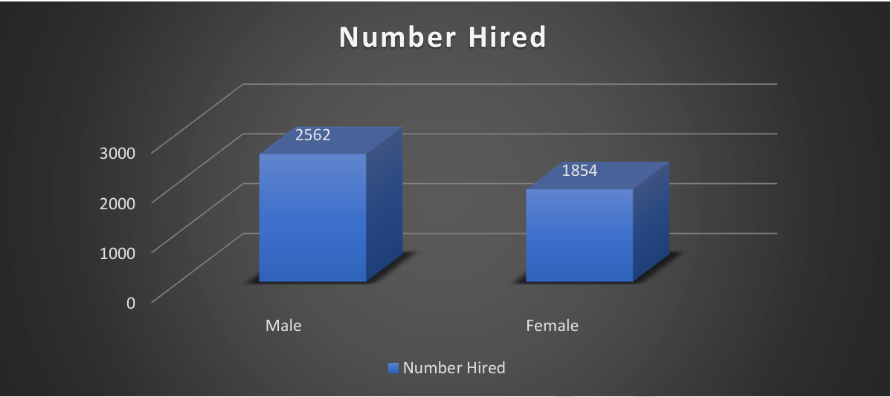
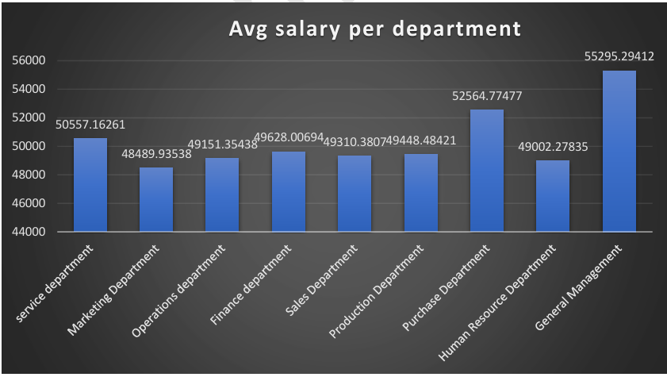
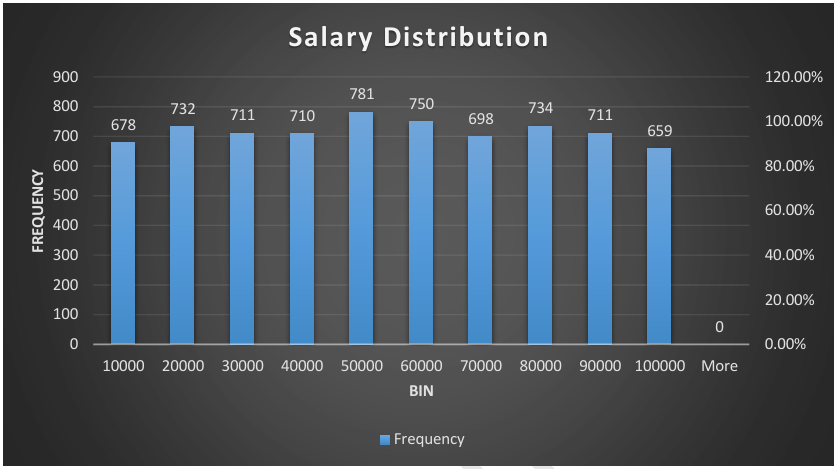
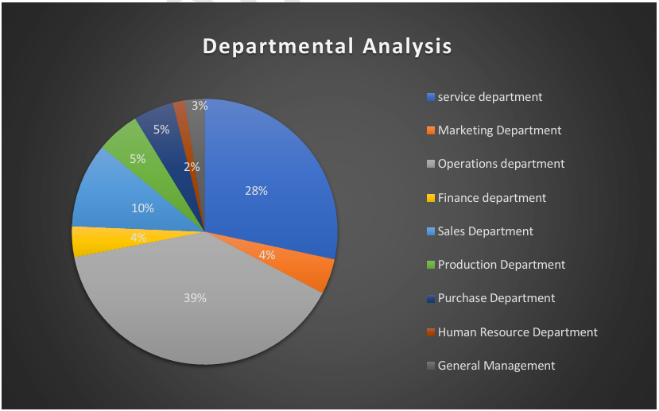
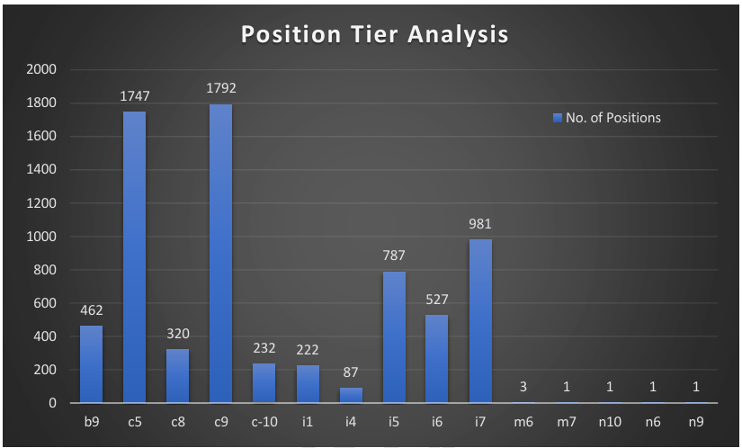

# Hiring Process Analytics

## Table of Contents

- [Project Overview](#Project-Overview)
- [Objectives](#Objectives)
- [Approach](#Approach)
- [Key Insights & Visualizations](#Key-Insights-&-Visualizations)
- [Tech Stack](#Tech-Stack) 

## Project-Overview

This project analyzes the hiring data of a multinational company (e.g., Google) to generate meaningful insights that can improve recruitment strategies. It explores hiring trends, gender distribution, salary analysis, departmental distribution, and organizational hierarchy.
 

## Objectives

- Analyze gender-based hiring trends
- Evaluate salary distribution across departments
- Handle missing data and detect outliers
- Visualize departmental and positional structures
 

## Approach

- **Data Source:** Historical hiring records
- **Cleaning:** Missing values in `Event_Name`, `Post Name`, `Offered Salary` are filtered out
- **Outlier Detection:** IQR method used to filter out salary anomalies
- **Tool Used:** Microsoft Excel 2019
 

## Key Insights & Visualizations

### 1. Gender Distribution of Hires

The analysis revealed a significant gender imbalance, with more male hires than female.

*Figure 1: Gender-wise distribution of hires*
 

### 2. Average Salary by Department

The **General Management** department received the highest average salary (~₹55,295), while the overall average was ₹49,878.

*Figure 2: Average salary by Department*
 

### 3. Salary Distribution

Most employees earn between ₹40,001–₹50,000, highlighting the common compensation range.

*Figure 3: salary Distribution based on BIN*

### 4. Departmental Workforce Distribution

**Operations Department** had the largest workforce (39%), while **Human Resources** had the smallest.

*Figure 4: Department Analysis of each department*

### 5. Position Tier Analysis

Tiers **C5** and **C9** dominate the hiring structure. The organization should encourage balanced role distribution for healthy competition and growth.

*Figure 5: Position Tier Analysis*

## Tech Stack

- **Microsoft Excel 2019**
  - Data Cleaning
  - Statistical Analysis
  - Pivot

## License

This project is licensed under the [MIT License](LICENSE).
